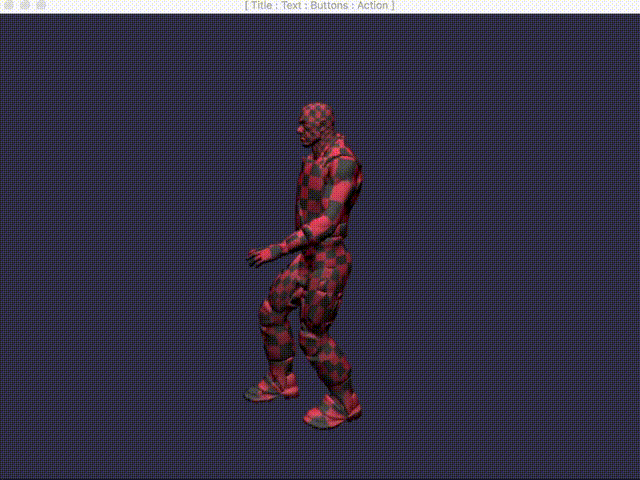

#### Learn Electron JS [ Create Crossplatform Desktop Apps using Javascript ]

This repository contains examples to create cross platform desktop application
using javascript with electron framework.

##### Sample Fusion App Electron.JS + Babylon.JS

The applications created using electron framework can run in Windows, Mac OSX and Linux.

This tutorial tries to use traditional programming style. It is an attempt to help people with system programming(C/C++) background to jump in and build desktop GUI applications.

