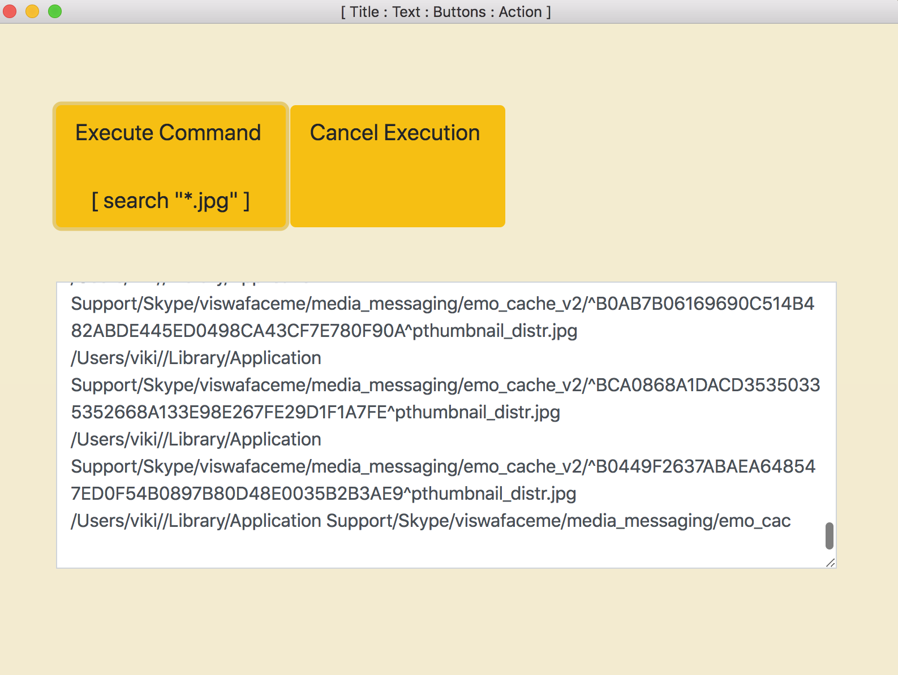

Executing a shell command asynchronously and cancel executing in the middle of execution.

To run your this electron app do the following:

	1. npm install
	2. npm start

	!! Your New Application Will Launch with Text Area!!
