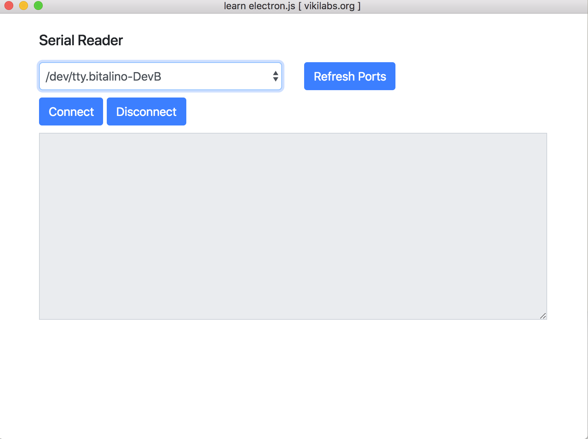

Serial port reader.

To run your this electron app do the following:
	1. npm install serialport
	2. npm install -g electron
	3. npm install --save-dev electron-rebuild
	4. Execute the following: [$ symbol should be included]
	   $(npm bin)/electron-rebuild
	5. npm install
	6. npm start

