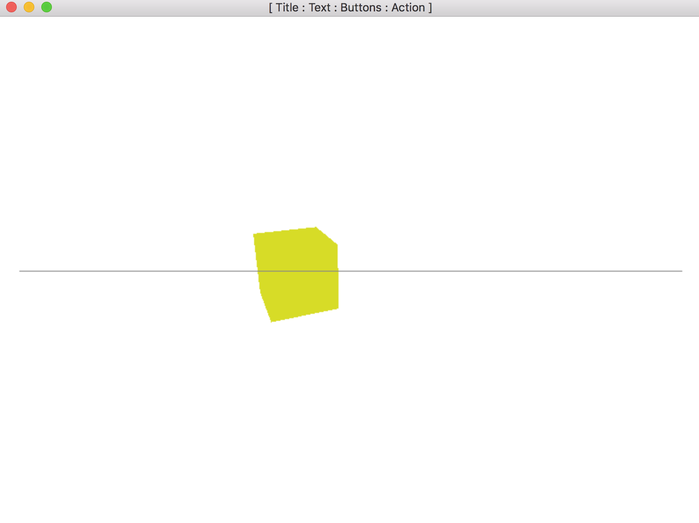

#### Create a 3D Cube using three.js in electron application

###### Debug Mode:

Change "var developer_mode = true;" in main.js

###### To run your this electron app do the following:

	1. npm install
	2. npm install babylonjs --save
	3. npm start

	!! Your New Application Will Launch with Text Area!!
