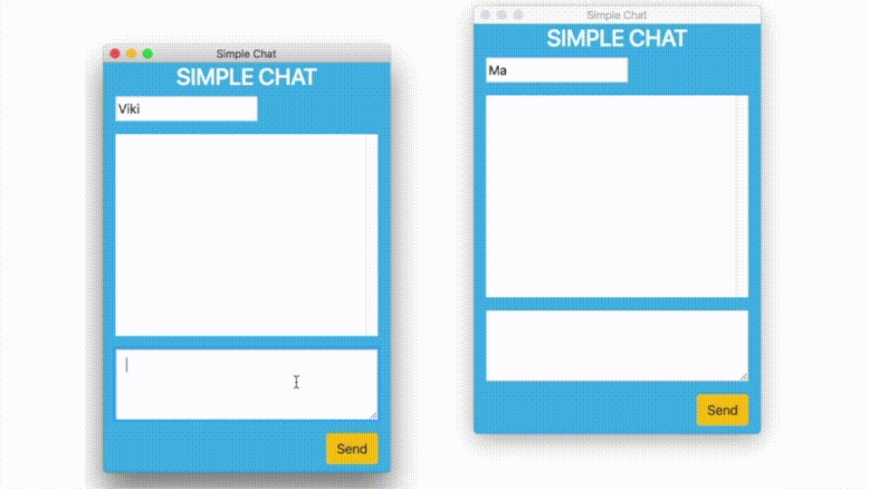

### Simple Chat Application using WebSockets

#### Step 1:  Install Essential Dependencies

	$npm install .

#### Step 2:  [ Open Terminal 1 ] Start WebSocket Server 
    
    $node server_app/websocket_server.js 

#### Step 3:  [ Open Terminal 2 ] Start Chat Client 1

	$npm start

#### Step 3:  [ Open Terminal 3 ] Start Chat Client 2
	
    $npm start

